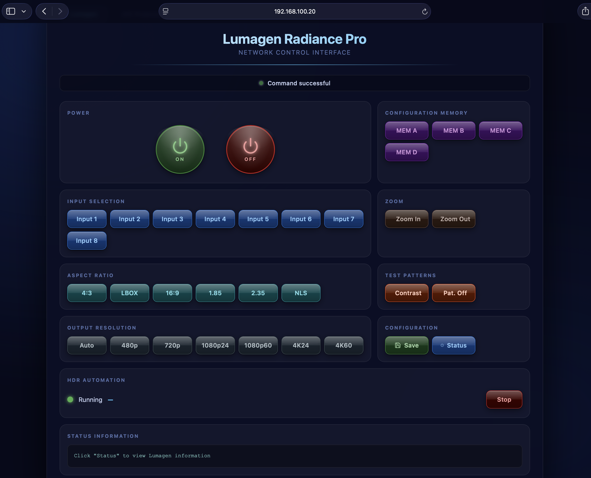
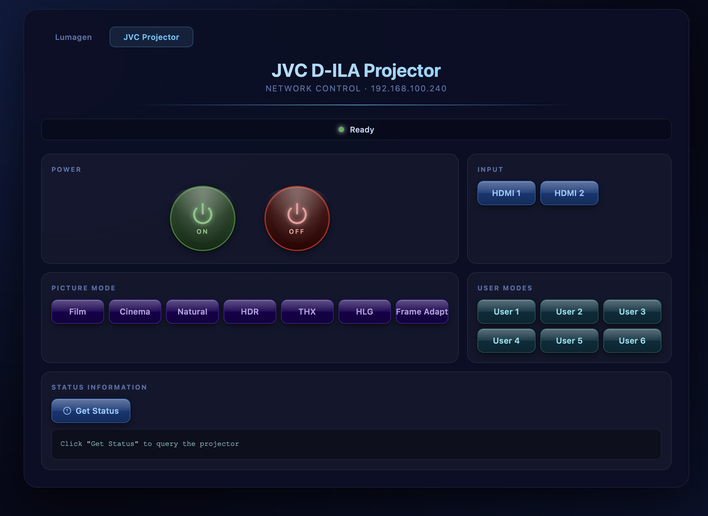

# jvclrpctl

Python library for controlling JVC D-ILA projectors (TCP/IP) and Lumagen Radiance video processors (USB serial), with automated HDR detection and picture mode switching.

## What's in this repo

| Component | Description |
|-----------|-------------|
| `jvclrpctl/` | Core Python library — JVC and Lumagen protocol implementation |
| `runner/runner.py` | Standalone HDR polling daemon |
| `lumagen_ui/` | Flask web UI — unified control panel for both devices |
| `systemd/` | systemd service for the runner daemon (headless mode) |

---

## Supported Devices

**JVC D-ILA Projectors** — any model supporting External Command Communication Specification v1.2:
- DLA-NX7, NX9, NX5, N8, N5
- DLA-RS2000, RS1000, RS500, V7 series

**Lumagen Radiance** — any model with RS-232 command interface:
- Radiance Pro (all variants)
- Radiance 2XXX, XD, XE

---

## Web UI (recommended)

`lumagen_ui/` is a Flask app served by gunicorn that provides browser-based control of both devices in a single interface. See [lumagen_ui/README.md](lumagen_ui/README.md) for setup.





**Lumagen page** (`/`): power, input selection, configuration memory, aspect ratio, zoom, output resolution, test patterns, save config, status, HDR automation start/stop.

**JVC page** (`/jvc`): power, HDMI input, picture mode (Film / Cinema / Natural / HDR / THX / HLG / Frame Adapt / User 1–6), projector status.

Power ON and OFF buttons on both pages require a browser confirmation dialog before executing, preventing accidental triggers.

---

## Python Library

### Installation

```bash
pip install -r requirements.txt
# or for development
pip install -e ".[dev]"
```

Requires Python 3.7+ and `pyserial`.

### HDR Automation

```python
from jvclrpctl import HDRAutomation, PictureMode

automation = HDRAutomation(
    jvc_ip='192.168.1.100',
    lumagen_port='/dev/ttyUSB0',
    poll_interval=2.0,
    sdr_mode=PictureMode.USER1,
    hdr_mode=PictureMode.USER2,
)
automation.start()
# runs in background — call automation.stop() to end
```

### JVC Projector Control

```python
from jvclrpctl import JVCProjector
from jvclrpctl.jvcctl import PictureModeController, PictureMode

with JVCProjector('192.168.1.100') as projector:
    controller = PictureModeController(projector)
    controller.set_mode(PictureMode.CINEMA)
    print(controller.get_current_mode().display_name)
```

### Lumagen Control

```python
from jvclrpctl import LumagenRadiance, LumagenCommands

with LumagenRadiance('/dev/ttyUSB0') as radiance:
    commands = LumagenCommands(radiance)
    print('HDR:', commands.is_hdr())
    status = commands.get_full_status_v4()
    print('Resolution:', status['source_resolution'])
```

---

## Project Structure

```
jvclrpctl/
├── jvclrpctl/              # Core library
│   ├── jvcctl/             # JVC protocol (TCP/IP, port 20554)
│   │   ├── connection.py   # JVCProjector — socket connect/handshake
│   │   ├── commands.py     # JVCCommands — power, input, picture mode
│   │   ├── picture_modes.py# PictureMode enum + PictureModeController
│   │   └── constants.py    # Wire-level bytes
│   ├── lumagen/            # Lumagen protocol (USB serial, 9600 baud)
│   │   ├── connection.py   # LumagenRadiance — serial open/close
│   │   ├── commands.py     # LumagenCommands — HDR status, full status
│   │   └── constants.py    # ZQI* query bytes, LRPInputModes enum
│   ├── automation.py       # HDRAutomation — background poll loop
│   └── logger.py           # Global logger singleton
├── runner/
│   └── runner.py           # Production HDR polling daemon
├── lumagen_ui/             # Flask web UI (Lumagen + JVC)
├── systemd/                # systemd service for runner daemon
├── examples/               # Example scripts
├── tests/                  # Unit tests
└── docs/                   # Protocol reference PDFs and guides
```

---

## Protocol Reference

| Device | Protocol | Spec |
|--------|----------|------|
| JVC | TCP/IP port 20554, ASCII commands | `docs/2018_ILA-FPJ_Ext_Command_List_v1.2.pdf` |
| JVC LAN | 3-way handshake (PJ_OK → PJREQ → PJACK) | `docs/ILAFPJ2021_LANconnection_spec_EN.pdf` |
| Lumagen | Serial 9600/8N1, ZQI* query commands | `docs/Tip0011_RS232CommandInterface_111023.pdf` |

---

## Platforms

| Platform | Status |
|----------|--------|
| Raspberry Pi 3/4 (Linux) | Primary target — runs as systemd service |
| macOS | Development / testing |
| Windows | Supported (use `COM3` etc. for serial port) |

See [docs/RASPBERRY_PI_SETUP.md](docs/RASPBERRY_PI_SETUP.md) for Pi-specific setup.

---

## Troubleshooting

**JVC won't connect** — verify IP, ensure network control is enabled on the projector, check port 20554 is reachable.

**Lumagen serial errors** — check `/dev/ttyUSB0` exists (`ls /dev/ttyUSB*`), ensure user is in the `dialout` group (`sudo usermod -a -G dialout $USER`), verify 9600 baud.

**HDR not switching** — ensure content is actively playing through Lumagen, check `DEBUG=true python runner/runner.py` output for poll results.

---

## License

MIT — see LICENSE file.
